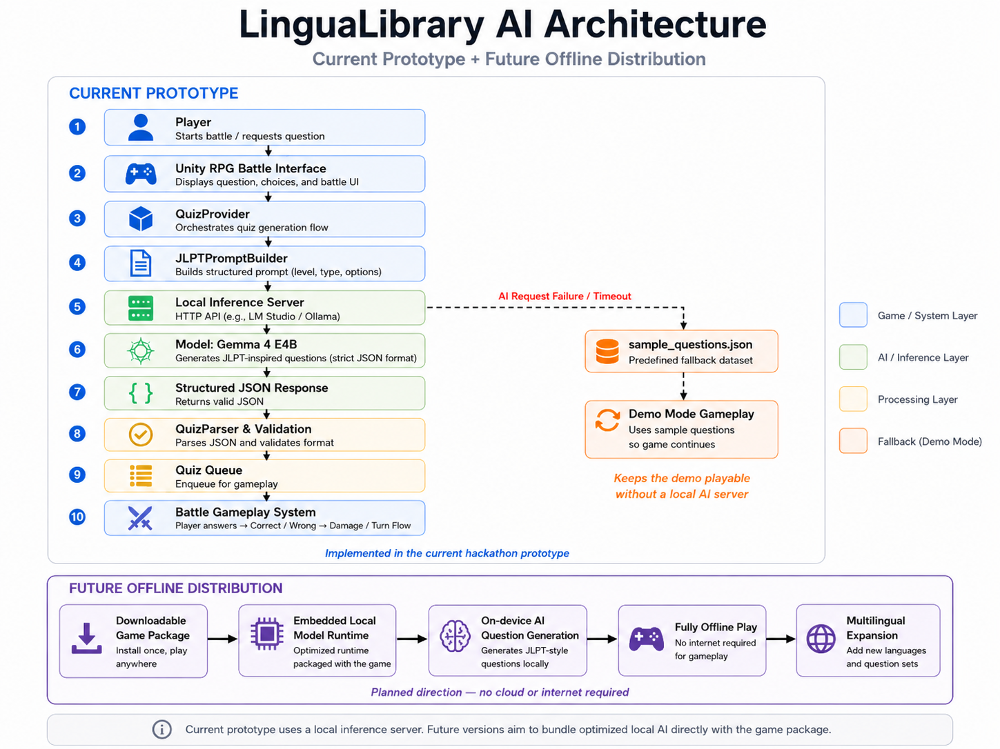

# LinguaLibrary AI

> The current AI-powered prototype of **Lingua Library**, a game-based multilingual language learning project.

---

## Overview

**Lingua Library** is a game-based language learning project, and **LinguaLibrary AI** is its current AI-powered hackathon prototype.

The current prototype focuses on Japanese learning through an RPG-style quiz battle system. Players answer AI-generated practice questions during battle encounters, and their answers directly affect the gameplay flow.

Instead of relying only on static worksheets, repetitive flashcards, or fixed question banks, LinguaLibrary AI transforms language practice into an interactive gameplay loop.

The current version is implemented as a Japanese learning prototype, but the long-term goal is to expand the same system into a multilingual language learning platform.

---

## What This Prototype Demonstrates

This prototype demonstrates three things:

1. A Unity-based RPG quiz battle loop where Japanese practice questions directly trigger combat actions.
2. Local Gemma 4 E4B generation through a local inference server, with structured JSON parsing and validation.
3. A reliable demo fallback system that keeps the game playable even when local AI generation is unavailable.

---

## The Problem

Language learners often face several challenges:

- Repetitive and static practice materials
- Limited access to tutors or premium platforms
- Low engagement and motivation
- Dependence on constant internet connectivity
- Lack of adaptive learning experiences
- Limited support for learners studying less commercially dominant languages

Traditional quiz apps can help with memorization, but they often fail to provide an engaging and repeatable learning experience.

A key issue is that repeated exposure to fixed question banks can lead learners to memorize answer positions, wording patterns, or familiar distractors instead of actively processing the language itself.

---

## Our Solution

LinguaLibrary AI uses Gemma 4 to dynamically generate structured language-learning questions and integrate them directly into gameplay.

Players:

- Solve Japanese practice questions
- Select answers during battle
- Trigger combat actions through correct responses
- Receive immediate correct / incorrect feedback
- Continue learning through repeated gameplay interaction

The result is a more engaging and scalable learning experience that combines AI-generated educational content with game-based motivation.

---

## Educational Design Rationale

LinguaLibrary AI is built around retrieval practice, immediate feedback, and game-based motivation.

Players repeatedly recall language knowledge through quiz answers, receive instant correct / incorrect feedback, and experience gameplay consequences through battle actions.

This design aims to make language practice more active and repeatable than passive review.

---

## Key Differentiators

LinguaLibrary AI is designed around four core ideas:

1. **AI-generated learning content**
   - Gemma 4 generates structured practice questions instead of relying only on fixed question banks.

2. **Game-based learning loop**
   - Quiz answers are connected to RPG battle actions, making practice more interactive and repeatable.

3. **Local-first prototype architecture**
   - The current prototype uses a local inference server instead of a cloud-only AI workflow.

4. **Demo and fallback reliability**
   - If the local AI server is unavailable, the game can fall back to bundled sample questions so the demo remains playable.

---

## Why Gemma 4

LinguaLibrary AI uses **Gemma 4 E4B running through a local inference server** to generate structured language-learning questions.

Gemma 4 is a strong fit for this prototype because it supports local inference, structured text generation, and flexible adaptation across different learning categories and language levels.

In this project, Gemma 4 is used to generate JLPT-inspired Japanese practice questions in a strict JSON format. The generated output is then parsed, validated, and inserted into the quiz battle loop.

> Note: The model name should be verified against the official hackathon naming guidelines and the exact local inference server model identifier before final submission.

---

## Digital Equity & Inclusivity

LinguaLibrary AI is designed with digital accessibility in mind.

Many language learners depend on paid tutors, premium learning platforms, or always-online services. These requirements can create barriers for learners who have limited internet access, limited financial resources, or privacy concerns.

By using a local-first AI architecture, LinguaLibrary AI explores a learning model that can reduce dependence on:

- Paid tutoring services
- Cloud-only AI platforms
- Constant internet connectivity
- Fixed and repetitive question banks
- Centralized learning platforms that may not support every learner's language goals

The current prototype focuses on Japanese learning, but the same architecture can be extended to other languages and exam systems.

This supports a broader vision: making adaptive language education more accessible, multilingual, and less dependent on expensive or always-connected infrastructure.

---

## Current Prototype: Japanese Quiz Battle Mode

The current implementation supports:

- Japanese practice questions
- JLPT-inspired learning format
- Multiple question categories
- Four-choice answer system
- RPG-style battle gameplay
- Quiz queue system
- Prompt-based question generation
- Structured quiz parsing
- Unity-based game UI
- Demo / fallback mode using bundled sample questions

### Supported Question Categories

- Kanji Reading
- Vocabulary
- Grammar
- Usage
- Sentence Assembly
- Context Understanding
- Synonym Selection
- Text Grammar

---

## Long-Term Vision

JLPT-inspired Japanese learning is only the first module.

The long-term goal is to evolve **Lingua Library** into a unified multilingual learning platform supporting:

- Korean TOPIK
- English TOEIC / IELTS
- Chinese HSK
- Spanish DELE
- French DELF
- German Goethe-Zertifikat
- Other language-learning goals and proficiency systems

The architecture separates:

- Language profiles
- Prompt templates
- Quiz validation
- Gameplay systems

This allows future language modules to reuse the same AI-powered learning pipeline.

---

## Future Offline Distribution

The current prototype uses Gemma 4 E4B through a local inference server. This already demonstrates a local-first approach, but it is not yet a fully bundled offline AI game.

The long-term goal is to move toward a fully bundled offline distribution where an optimized local model runtime is packaged together with the game client.

In future versions, learners should be able to download the game and generate new questions directly on their own device without requiring internet access, a separate cloud API, or a manually configured local inference server.

This distinction is important:

- **Current prototype:** Unity game client + external local inference server
- **Future goal:** downloadable game package + embedded local AI runtime

This direction is especially important for:

- Classrooms with unstable internet access
- Learners who cannot rely on paid cloud-based learning platforms
- Privacy-sensitive learning environments
- Communities that need multilingual learning tools without always-online infrastructure

---

## Architecture

The current prototype uses a Unity game client connected to Gemma 4 E4B through a local inference server. The model generates JLPT-inspired practice questions in a strict JSON format. The generated response is parsed, validated, stored in a quiz queue, and then used by the RPG battle gameplay system.

If the local AI request fails or times out, the game falls back to bundled sample questions from `sample_questions.json`, allowing the demo to remain playable without requiring a local AI server.



```text
Unity Game Client
    ↓
QuizProvider
    ↓
JLPTPromptBuilder
    ↓
Local Inference Server
    ↓
Model: Gemma 4 E4B
    ↓
Structured JSON Response
    ↓
QuizParser & Validation
    ↓
Quiz Queue
    ↓
Battle Gameplay System
```

---

## Validation Rules

Because AI-generated educational content can be inconsistent, LinguaLibrary AI does not directly trust raw model output.

Before a generated quiz enters gameplay, the system validates the response using several structural checks:

- The response must be parseable as JSON.
- The response must contain a quiz batch structure.
- Each quiz must include a non-empty question.
- Each quiz must include exactly four answer options.
- The correct answer index must be within the valid range.
- Invalid or incomplete quizzes are discarded.
- If parsing or validation fails, the system retries generation or falls back to sample questions.

This validation layer is important because it reduces the chance of broken JSON, missing options, invalid answer indices, or unusable quiz data interrupting the game flow.

The current validation system focuses on **structural reliability**, not full pedagogical correctness. It checks whether the AI output can safely enter gameplay, but it does not yet fully guarantee that every generated answer is linguistically perfect.

For this reason, the prototype combines prompt constraints, category-specific examples, fallback sample questions, and future plans for learner feedback and teacher review.

Future versions will add stronger review mechanisms such as:

- Answer explanation checks
- Difficulty calibration
- Teacher review tools
- Learner feedback loops
- Incorrect-question reporting
- Curated dataset evaluation

---

## Demo Mode and Fallback System

LinguaLibrary AI supports two execution modes:

1. **Local Gemma Mode**
   - Uses Gemma 4 E4B through a local inference server.
   - Generates JLPT-inspired Japanese practice questions dynamically.
   - Parses and validates the AI response before using it in gameplay.

2. **Demo / Fallback Mode**
   - Uses bundled sample questions from `Assets/StreamingAssets/sample_questions.json`.
   - Allows the game to remain playable even when a local Gemma server is unavailable.
   - Helps judges and testers experience the gameplay loop without installing a local AI runtime.

If the local inference server cannot be reached, if the AI request times out, or if the model output cannot be parsed into valid quiz data, the game automatically falls back to sample questions when `fallbackToSampleQuestions` is enabled.

This fallback system is not only a temporary demo feature. In future offline versions, fallback and cached question systems will remain important for handling low-spec devices, model loading delays, timeout, corrupted model files, or invalid AI output.

---

## Example Gameplay Loop

```text
Question Generated
    ↓
Player Selects Answer
    ↓
Battle Action Triggered
    ↓
Correct / Incorrect Feedback
    ↓
Next Question Loaded
```

---

## Tech Stack

- Unity 6
- C#
- Gemma 4 E4B
- Local inference server workflow
- Prompt-based structured generation
- JSON-based parsing and validation
- Demo fallback using bundled sample questions

---

## Screenshots

### Gameplay


### Battle Feedback


---

## Current Development Status

Current state:

- Prototype completed
- GitHub repository prepared
- Gameplay loop implemented
- Local inference workflow implemented
- Demo / fallback mode implemented
- Windows demo build prepared
- Submission materials being prepared for the Gemma 4 Hackathon

Planned next steps:

- Adaptive difficulty system
- Additional language modules
- Review system for incorrect answers
- Audio and pronunciation training
- Multimodal learning content
- Teacher dashboard
- Fully bundled offline AI runtime
- Web or mobile deployment

---

## Setup

### Option 1: Run the Windows Demo

The Windows demo can be downloaded from the GitHub Releases page.

The demo is designed to be playable even without a local Gemma server by using bundled sample questions in Demo / Fallback Mode.

1. Download the latest Windows demo zip from GitHub Releases.
2. Extract the zip file.
3. Run the executable file.
4. Play the quiz battle demo.

No local AI setup is required for the default demo experience.

---

### Option 2: Run from Unity

Requirements:

- Unity 6
- Project source code from this repository

Steps:

1. Clone this repository.
2. Open the project in Unity.
3. Open the main gameplay scene.
4. Confirm that `Assets/StreamingAssets/sample_questions.json` exists.
5. Press Play in the Unity Editor.

If no local inference server is running, the game can still use bundled sample questions when fallback mode is enabled.

---

### Option 3: Use Local Gemma Mode

To test dynamic AI-generated questions:

1. Run a Gemma 4 E4B-compatible local inference server.
2. Copy `Assets/StreamingAssets/config.example.json` to `Assets/StreamingAssets/config.json`.
3. Update the local server endpoint and model name in `config.json`.
4. Set `useDemoMode` to `false`.
5. Set `fallbackToSampleQuestions` to `true`.
6. Run the game.

Example configuration:

```json
{
  "apiUrl": "http://127.0.0.1:1234/v1/chat/completions",
  "model": "gemma-4-e4b",
  "useDemoMode": false,
  "fallbackToSampleQuestions": true,
  "timeoutSeconds": 10
}
```

For demo-only testing without local AI generation, set:

```json
{
  "apiUrl": "http://127.0.0.1:1234/v1/chat/completions",
  "model": "gemma-4-e4b",
  "useDemoMode": true,
  "fallbackToSampleQuestions": true,
  "timeoutSeconds": 10
}
```

---

## Repository Structure

```text
Assets/
├─ StreamingAssets/
│  ├─ sample_questions.json
│  └─ config.example.json
Packages/
ProjectSettings/
docs/
├─ Architecture.png
├─ GamePlay.png
└─ Battle_correct.png
```

---

## Hackathon Submission

This project is being prepared for the Gemma 4 Hackathon under the categories:

- Future of Education
- Digital Equity & Inclusivity

LinguaLibrary AI fits these categories because it explores how local AI inference can support accessible, adaptive, and privacy-conscious language education.

---

## Disclaimer

LinguaLibrary AI is an independent educational prototype.

The current Japanese learning module generates JLPT-inspired practice questions for study purposes. It is not affiliated with, endorsed by, or officially connected to the official JLPT organization or any related testing authority.

The generated questions are AI-created practice materials and are not official exam questions.
