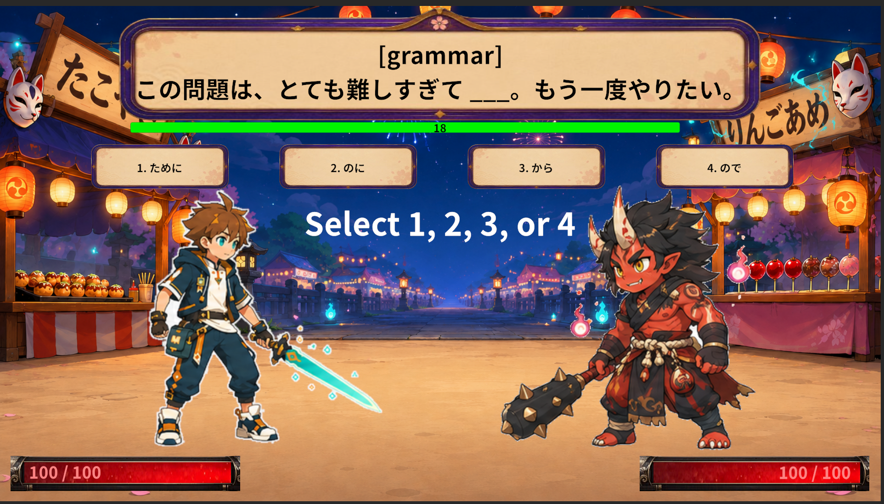
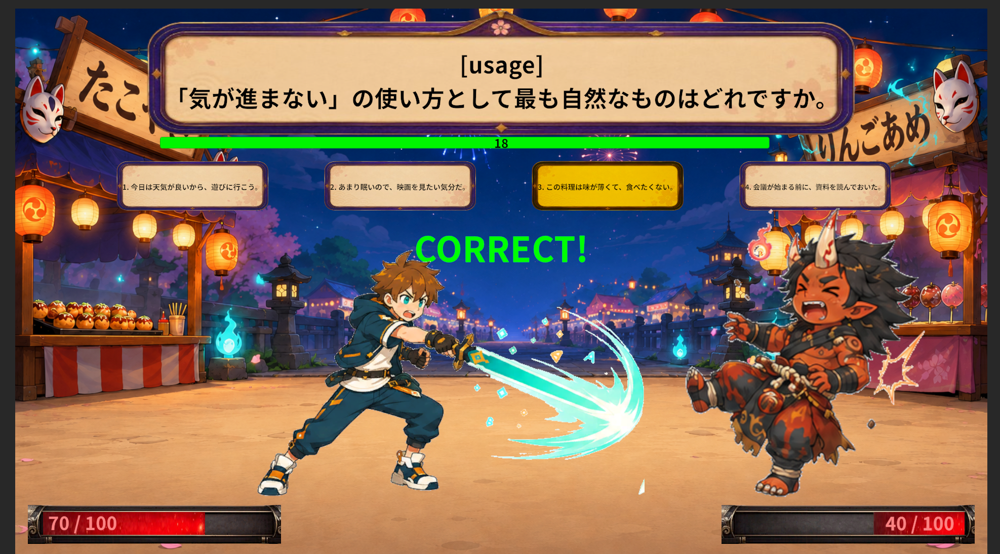

# LinguaLibrary AI

> A Gemma 4-powered multilingual language learning platform, starting with Japanese learning through an RPG-style quiz battle prototype.

---

## Overview

LinguaLibrary AI is a game-based language learning platform that combines RPG gameplay with AI-generated educational content.

The current prototype focuses on Japanese learning, where players answer AI-generated practice questions during RPG-style battle encounters.

Instead of relying only on static worksheets, repetitive flashcards, or fixed question banks, LinguaLibrary AI transforms language practice into an interactive gameplay loop.

The current version is implemented as a Japanese learning prototype, but the long-term goal is to expand the same system into a multilingual learning platform.

---

## The Problem

Language learners often face several challenges:

- Repetitive and static practice materials
- Limited access to tutors or premium platforms
- Low engagement and motivation
- Dependence on constant internet connectivity
- Lack of adaptive learning experiences
- Limited support for learners studying less commercially dominant languages

Traditional quiz apps can help with memorization, but they often fail to provide an engaging and repeatable learning experience.

---

## Our Solution

LinguaLibrary AI uses Gemma 4 to dynamically generate structured language-learning questions and integrate them directly into gameplay.

Players:

- Solve Japanese practice questions
- Select answers during battle
- Trigger combat actions through correct responses
- Receive immediate correct / incorrect feedback
- Continue learning through repeated gameplay interaction

The result is a more engaging and scalable learning experience that combines AI-generated educational content with game-based motivation.

---

## Why Gemma 4

LinguaLibrary AI uses **Gemma 4 E4B running through a local inference server** to generate structured language-learning questions.

This approach reduces dependency on cloud-only AI platforms and supports more privacy-preserving learning workflows.

Gemma 4 enables:

- Local AI inference
- Structured educational content generation
- Lower dependency on constant internet connectivity
- Reduced reliance on paid cloud-based learning tools
- More privacy-preserving learning workflows
- Flexible expansion to multiple languages and exam systems

Instead of manually authoring thousands of static questions, the system generates quiz content dynamically through prompt-driven generation and validates the model output before it enters gameplay.

---

## Digital Equity & Inclusivity

LinguaLibrary AI is designed with digital accessibility in mind.

Many language learners depend on paid tutors, premium learning platforms, or always-online services. These requirements can create barriers for learners who have limited internet access, limited financial resources, or privacy concerns.

By using local Gemma 4 inference, LinguaLibrary AI aims to reduce dependency on:

- Paid tutoring services
- Cloud-only AI platforms
- Constant internet connectivity
- Fixed and repetitive question banks
- Centralized learning platforms that may not support every learner's language goals

The current prototype focuses on Japanese learning, but the same architecture can be extended to other languages and exam systems.

This supports a broader vision: making adaptive language education more accessible, multilingual, and less dependent on expensive or always-connected infrastructure.

---

## Current Prototype: Japanese Quiz Battle Mode

The current implementation supports:

- Japanese practice questions
- JLPT-inspired learning format
- Multiple question categories
- Four-choice answer system
- RPG-style battle gameplay
- Quiz queue system
- Prompt-based question generation
- Structured quiz parsing
- Unity-based game UI

### Supported Question Categories

- Kanji Reading
- Vocabulary
- Grammar
- Usage
- Sentence Assembly
- Context Understanding
- Synonym Selection
- Text Grammar

---

## Long-Term Vision

JLPT-inspired Japanese learning is only the first module.

The long-term goal is to evolve LinguaLibrary AI into a unified multilingual learning platform supporting:

- Korean TOPIK
- English TOEIC / IELTS
- Chinese HSK
- Spanish DELE
- French DELF
- German Goethe-Zertifikat
- Other language-learning goals and proficiency systems

The architecture separates:

- Language profiles
- Prompt templates
- Quiz validation
- Gameplay systems

This allows future language modules to reuse the same AI-powered learning pipeline.

---

## Architecture

```text
Unity Game Client
    ↓
QuizProvider
    ↓
PromptBuilder
    ↓
Local Gemma-Compatible Inference Server
    ↓
Model: Gemma 4 E4B
    ↓
Structured JSON Response
    ↓
JSON Parser / Validator
    ↓
Quiz Queue
    ↓
RPG Battle Gameplay
```

---

## Example Gameplay Loop

```text
Question Generated
    ↓
Player Selects Answer
    ↓
Battle Action Triggered
    ↓
Correct / Incorrect Feedback
    ↓
Next Question Loaded
```

---

## Tech Stack

- Unity 6
- C#
- Gemma 4 E4B
- Local inference server workflow
- Prompt-based structured generation
- JSON-based parsing and validation

---

## Screenshots

### Gameplay



### Battle Feedback



---

## Current Development Status

Current state:

- Prototype completed
- GitHub repository prepared
- Gameplay loop implemented
- README and hackathon documentation in progress
- Submission materials being prepared for the Gemma 4 Hackathon

Planned next steps:

- Adaptive difficulty system
- Additional language modules
- Review system for incorrect answers
- Audio and pronunciation training
- Multimodal learning content
- Teacher dashboard
- Web or mobile deployment

---

## Setup

### Requirements

- Unity 6
- Gemma 4 E4B running through a local inference server

### Run Instructions

1. Clone this repository.
2. Open the project in Unity.
3. Configure the local inference server endpoint.
4. Launch the main gameplay scene.
5. Start learning through RPG-style quiz battle gameplay.

---

## Repository Structure

```text
Assets/
Packages/
ProjectSettings/
docs/
├─ GamePlay.png
└─ Battle_correct.png
```

---

## Hackathon Submission

This project is being prepared for the Gemma 4 Hackathon under the categories:

- Future of Education
- Digital Equity & Inclusivity

LinguaLibrary AI fits these categories because it explores how local AI inference can support accessible, adaptive, and privacy-conscious language education.

---

## Disclaimer

LinguaLibrary AI is an independent educational prototype.

The current Japanese learning module generates JLPT-inspired practice questions for study purposes. It is not affiliated with, endorsed by, or officially connected to the official JLPT organization or any related testing authority.

The generated questions are AI-created practice materials and are not official exam questions.
